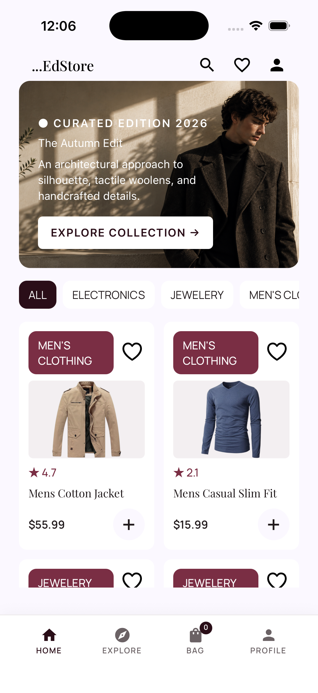
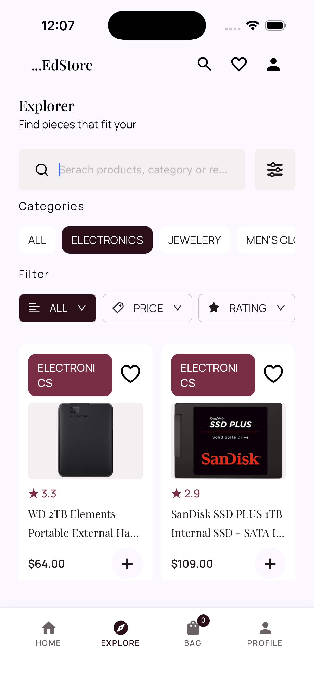
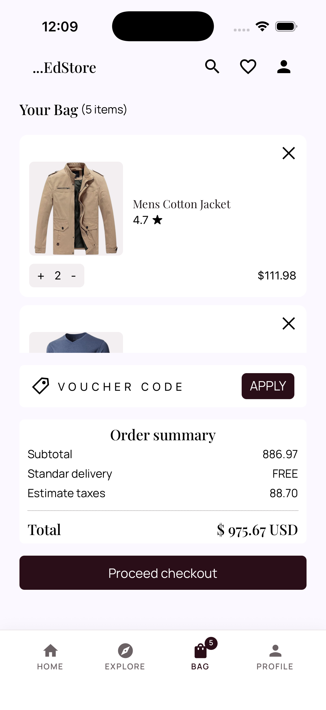
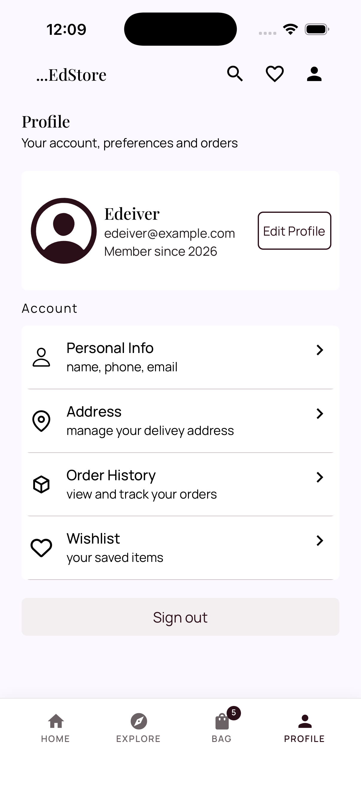

<div align="center">

# edStore

**A modern e-commerce app built with React Native & Expo**

Browse a real multi-category catalog (clothing, electronics, jewelry and more), filter and search products in real time, and manage a shopping bag — all powered by a clean component architecture and a live product API.

[](https://expo.dev)
[](https://reactnative.dev)
[](https://react.dev)
[](./LICENSE)

</div>

---

## Screenshots

<table>
  <tr>
    <td></td>
    <td></td>
    <td></td>
    <td></td>
  </tr>
  <tr>
    <td align="center">Home</td>
    <td align="center">Explore</td>
    <td align="center">Bag</td>
    <td align="center">Profile</td>
  </tr>
</table>

## About the project

edStore is a personal portfolio project built to practice and showcase real-world React Native patterns: navigating between authenticated/unauthenticated flows, consuming a REST API, managing global state with Context, persisting data on-device, and building a fully custom, themeable UI kit from scratch (no UI library).

Product and category data comes live from the **[Fake Store API](https://fakestoreapi.com)** — a free, public REST API for e-commerce demos and prototypes — so the catalog, prices, and ratings you see in the app are real API responses, not mocked/hardcoded data. The catalog spans the API's real categories (**electronics, jewelery, men's clothing, women's clothing**), while the Home screen's hero banner uses a fashion-styled promo purely as seasonal marketing copy — it doesn't limit what's actually sold in the store. All product, category, user, and login requests in `src/api/index.js` hit `https://fakestoreapi.com` directly; no API key or backend of your own is required to run this project.

## Features

- **Home** — hero banner, horizontally scrollable category chips, and a two-column product grid pulled live from the Fake Store API.
- **Explore** — search by title, category or description, filter by department, and sort by price, rating, or "recommended".
- **Bag** — add/remove items, adjust quantities, see a live order summary (subtotal, estimated taxes, total) and a cart badge on the tab bar.
- **Persistent cart** — the bag survives an app restart: `CartContext` automatically loads and saves the cart to `AsyncStorage` on every change.
- **Profile** — account overview and a menu of account sections (personal info, address, order history, wishlist), with a working sign-out.
- **Authentication** — a real Login and Register flow backed by `AuthContext`: signing in persists the session to `AsyncStorage` (survives an app restart), `AppNavigation` automatically swaps between the auth stack and the main app based on session state, and signing out clears it.
- **Custom design system** — a single `theme.js` (colors, typography, spacing, radius) driving every screen and component, with Manrope + Playfair Display custom fonts.

### Work in progress

This is an actively evolving portfolio project. A few things are intentionally left as scaffolding for now:

- **Registration is UI-complete but the API behind it is a mock** — the Fake Store API's `POST /users` accepts new sign-ups and returns a success response, but doesn't actually persist them for login. After "creating" an account, you sign in using one of the API's fixed demo users instead (shown right on the Login screen) — this is called out in the app itself, not just here.
- **Checkout, voucher codes, and some profile actions** (edit profile) are present in the UI but not yet wired to real logic.

## Tech stack

| Layer | Technology |
|---|---|
| Framework | [Expo](https://expo.dev) (SDK 57) + [React Native](https://reactnative.dev) 0.86 |
| UI library | React 19 |
| Navigation | [React Navigation](https://reactnavigation.org) — native stack + bottom tabs, with a fully custom tab bar |
| State management | React Context API (`CartContext`, `AuthContext`) |
| Persistence | `@react-native-async-storage/async-storage` — the cart and the auth session are both saved on-device and restored on launch |
| Data source | **[Fake Store API](https://fakestoreapi.com)** (REST, no auth key needed) — products, categories, users, and a demo login endpoint |
| Fonts / Icons | `@expo-google-fonts` (Manrope, Playfair Display), `@expo/vector-icons` |

## Project structure

```
edStore/
├── App.js                     # Font loading, providers, entry point
├── app.json                   # Expo app config
├── src/
│   ├── api/                   # Fake Store API client (products, categories, users, auth)
│   ├── components/            # Reusable UI: Button, Input, Header, Hero, ProductCard, ...
│   ├── contexts/               # CartContext, AuthContext (state + AsyncStorage persistence)
│   ├── navigation/             # AppNavigation (auth-aware), AuthNavigator, MainNavigator
│   ├── screens/                 # Home, Explore, Bag, Profile
│   │   └── auth/                # Login, Register
│   ├── style/                  # theme.js (design tokens) + globalStyles.js
│   └── assets/img/              # Local images (hero banner, etc.)
└── assets/                     # App icons and splash assets
```

## Getting started

### Prerequisites

- [Node.js](https://nodejs.org) 18 or newer
- npm (bundled with Node)
- The [Expo Go](https://expo.dev/go) app on your phone (easiest way to run it), **or** an Android/iOS simulator set up locally

### Installation

```bash
# 1. Clone the repository
git clone https://github.com/edeiver/edStore.git
cd edStore

# 2. Install dependencies
npm install

# 3. Start the Expo dev server
npm start
```

This opens the Expo developer tools in your terminal with a QR code. From there you can:

```bash
npm run android   # open in a connected device/emulator with Android
npm run ios       # open in the iOS simulator (macOS only)
npm run web       # open in your browser
```

Or scan the QR code with the **Expo Go** app on your phone for the fastest way to try it on a real device — no build step required.

No environment variables or API keys are needed: the app talks directly to the public Fake Store API (`https://fakestoreapi.com`).

## Roadmap

- [ ] Wire up checkout, voucher codes, and the remaining profile actions
- [ ] Add product detail screen
- [ ] Add automated tests

## License

Distributed under the MIT License. See [`LICENSE`](./LICENSE) for details.

---

<div align="center">
Built by <a href="https://github.com/edeiver">Edeiver Barranco</a> as a front-end/mobile development portfolio piece.
</div>
